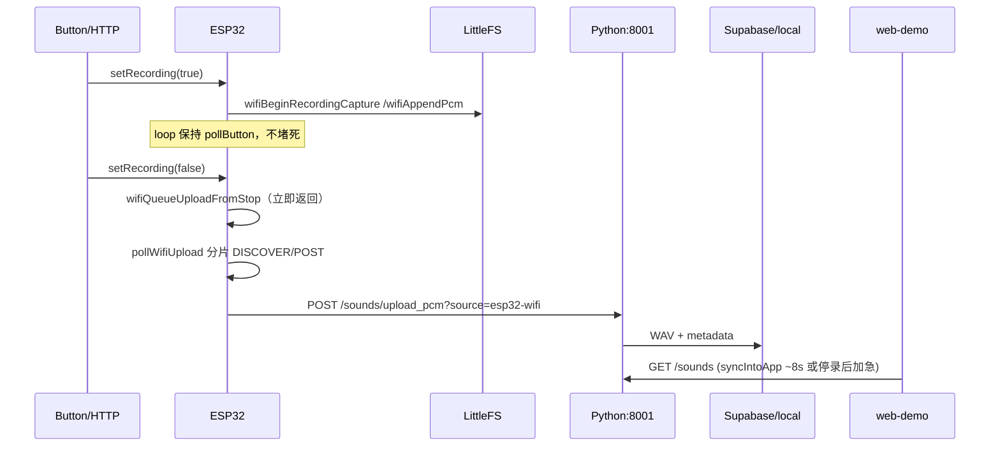

# Piko 交互基准（Wi‑Fi 优先 · USB 可选降级）

> **产品北星**：最终运行时是 **iPad App 独立运作**（内嵌 UI + 接收 ESP 上传 + 曲库）；Mac/PC Python/Bridge 仅为开发联调脚手架。  
> **定位**：本文件是录音 / 上传 / 实时电平 / 曲库同步的**交互契约与工作流基准**。  
> 后续任何改动（固件、Python、Bridge、web-demo、iPad）须先对照本文；**默认不破坏下列不变量与路径语义**。  
> 中文总览与独立化差距：[`Piko中文交互说明与iPad就绪.md`](./Piko中文交互说明与iPad就绪.md)。运行手册：`AGENTS.md`。

**状态**：硬件热点联调已验证 ESP → `upload_pcm`。生产接收端为 iPad `LocalPikoGateway`；配置 anon 后写入 **Supabase**（与 Mac Python service_role 路径并存）。Mac Python 仍为开发兼容实现。

---

## 1. 怎么用这份文档改代码

1. 先判断改动属于哪条**主路径**（§3）和哪个**文件所有权**（§8）。
2. 对照 **§7 不变量**：冲突则先改设计，再写代码。
3. 新功能优先**挂接现有扩展点**（`setRecording`、`pollWifiUpload`、`sendCommand`、`syncIntoApp`），禁止再开第二条平行录音状态机。
4. USB 与 Wi‑Fi 可并存，但**产品语义以 Wi‑Fi 优先**；无 Bridge 时不得假装有桌面级实时 PCM 波形。
5. 改完用 §9 最小验收清单自测。

---

## 2. 角色与端口

| 角色 | 职责 | 端口 / 传输 |
|------|------|-------------|
| **ESP32** `esp32/inmp441_bridge.ino` | 按键、I2S 录音、TFT、LittleFS、Wi‑Fi 上传、HTTP 控制面 | STA Wi‑Fi；HTTP **:8080**；可选 USB 串口 @ 500000 |
| **上传接收端（生产 = iPad `LocalPikoGateway`；开发 = Python）** | `GET /health`、`POST /sounds/upload_pcm`、`GET /sounds`、announce/代理、（iPad）静态 web-demo | HTTP **:8001** 同契约 |
| **Bridge** `bridge/serial-bridge.js` | **仅开发机可选** USB：串口 ↔ WS、会话 WAV 上传 | WS **:8765**，health **:8766** |
| **web-demo** | 录音 UI、电平、曲库同步；生产打进 iPad Bundle | 开发期静态 **:8000**；生产由 iPad :8001 托管 |
| **iPad App** `ios/PikoShell` | **产品运行时**：UI + 本地网关 + Documents 曲库 | 监听 **0.0.0.0:8001**；直连 ESP |

热点联调：手机热点（2.4GHz）+ Mac/PC + ESP32 同网；Python 必须监听 **0.0.0.0**，不能只绑 localhost。

---

## 3. 主工作流（基准路径）

### 3.1 Wi‑Fi 录音上传（当前产品主路径）



要点：

- 设备侧**唯一**录音状态入口：`setRecording(enabled, source)`。
- 停录**只入队**上传，禁止在 `setRecording(false)` 内同步跑完整 HTTP POST / 全网段扫描。
- 上传由 `pollWifiUpload()` 状态机推进：`IDLE → PREPARE → DISCOVER? → POST`（有限重试）。
- `source` 标记：**`esp32-wifi`**（勿与 USB 的 `esp32` 混用）。

### 3.2 实时电平（Wi‑Fi）

```
I2S → wifiUpdateLiveMetrics → GET :8080/metrics
web: Esp32AudioAdapter 轮询 wifiBase/metrics
     失败则 Python GET /esp32/metrics（依赖 POST /esp32/announce）
```

- Wi‑Fi 实时 = **音量 / peak / recording 标志**，不是 USB 那种逐帧 PCM 波形。
- USB 在线且 `isUsbLive()` 时，前端优先 USB，可暂停 Wi‑Fi 轮询。

### 3.3 USB 残路径（可选，不得成为 Wi‑Fi 前提）

```
ESP 串口 PCM/JSON → Bridge :8765 → web 波形
停录 → Bridge 组 WAV → POST /sounds/upload (source=esp32)
```

- 无 USB 设备 / 无 Bridge 时，整条链路应静默降级，**不得阻断**按键录音 + Wi‑Fi 上传 + 曲库同步。
- `WIFI_DISABLE_USB_PCM=1` 可关 USB PCM，仍保留串口 JSON/命令（调试用）。

### 3.4 网页启停 vs 物理按键

| 触发 | 调用链 | 要求 |
|------|--------|------|
| 物理键 | `pollButton` → `setRecording(..., "button")` | 任意上传阶段仍应能再次按到（新录音可取消上传相位） |
| 网页 Wi‑Fi | `FieldRecorder` → `sendCommand` → `POST /record/start\|stop`（直连 ESP 或经 Python proxy） | HTTP **先响应**；上传异步 |
| 网页 USB | 同上 → Bridge WS → `REC_START/STOP` | 可等 `record_ack` |
| 超时 | `pollRecordingTimeout` → `setRecording(false, "timeout")` | 与按键停录同一套入队上传 |

硬件按键与网页状态通过 `hw_record` / metrics 的 `recording` 边沿对齐；网页侧 `skipSerialCommand` 避免二次下发。

---

## 4. 端点契约（勿随意改名/改语义）

### ESP32 `:8080`

| 方法 | 路径 | 语义 |
|------|------|------|
| GET | `/status` · `/` | 连接/录音/IP/`uploadHost` 等 |
| GET | `/metrics` | 实时 volume/peak/recording/liveAt |
| POST | `/record/start` | → `setRecording(true, "wifi_http")` |
| POST | `/record/stop` | → `setRecording(false, …)` 或补入队；JSON 可含 `uploading` |
| — | CORS + OPTIONS | 浏览器直连必需 |

### Python `:8001`

| 方法 | 路径 | 语义 |
|------|------|------|
| GET | `/health` | 探活；ESP 发现 host 用 |
| POST | `/sounds/upload_pcm` | 原始 PCM16 LE → WAV 入库；默认/约定 `source=esp32-wifi` |
| POST | `/sounds/upload` | multipart WAV（Bridge USB） |
| GET | `/sounds` | 曲库列表；支持 `since` 增量 |
| POST | `/esp32/announce` | ESP 登记 IP:8080 |
| GET | `/esp32` | 读 announce |
| GET | `/esp32/metrics` | 代理到已 announce 的 ESP（**须非阻塞事件循环**） |
| POST | `/esp32/record/{start\|stop}` | 代理控制（**须非阻塞事件循环**） |

### Bridge（可选）

| 端口 | 用途 |
|------|------|
| WS `:8765` | `record_start/stop`、metrics、PCM、session |
| HTTP `:8766/health` | 探活 |

### 前端入口解析顺序（`pikoCloudConfig.js`）

1. URL `?api=` / `?bridge=` / `?esp32=`（写入 localStorage）  
2. localStorage  
3. 远程 analysisBase（若配置）  
4. 页面为 LAN IP 时同主机 `:8001` / `:8765`  
5. loopback  

`isWifiFirstMode()`：配置了 esp32 base、或非本机开发页、或 `piko.wifiFirst=1`。

---

## 5. 曲库与前端同步

| 时机 | 行为 |
|------|------|
| 常态 | `ServiceConnectionManager`：Python 健康且（无 Bridge 或 wifi-first）→ 约 **8s** `syncIntoApp({ incremental: true })` |
| Wi‑Fi UI 停录后 | `finishWifiUploadSession` 短间隔加急拉取 |
| USB Bridge 上传完成 | `onSession uploaded` → sync |

前端 IndexedDB = **UI 缓存**；云端/Python 列表 = 跨设备真源（见 health 中 supabase 提示）。

---

## 6. `source` 标签约定

| source | 含义 | 产生方 |
|--------|------|--------|
| `esp32-wifi` | 设备 Wi‑Fi PCM 上传 | ESP `upload_pcm` |
| `esp32` | Bridge USB 会话 WAV | Bridge `/sounds/upload` |
| `esp32-record` | 前端本地保存的 USB 录音元数据 | FieldRecorder（若走本地保存） |

分析 / 笔刷 / Library 展示若按来源过滤，必须识别 `esp32-wifi`，不能只认 `esp32`。

---

## 7. 不变量（破坏即回归）

1. **按键始终可响应**：`loop` 中 `pollButton` 不被长时间同步 HTTP/全网扫描卡住；停录只 `wifiQueueUploadFromStop`。  
2. **上传分片**：`pollWifiUpload` 推进；开始新录音可取消上传相位，且不得误删新文件。  
3. **开始录音不做同步 LAN 扫网**（扫网只在上传 DISCOVER 相位，且按 tick 限额 probe）。  
4. **Python 绑定 `0.0.0.0:8001`**，供热点上的 ESP / iPad 访问。  
5. **代理 ESP 的 Python 路由不得阻塞事件循环**（同步 `urlopen` 必须进线程，否则会拖死 `upload_pcm`）。  
6. **前端不存放** SiliconFlow Key / Supabase service_role 等密钥。  
7. **无 USB 时功能完整集**：按键录音 → Wi‑Fi 上传 → 曲库出现；允许无桌面级实时波形。  
8. **不改默认波特率/共享硬编码路径**：串口差异用参数或环境变量；跨平台不覆盖对方 `.venv`。  
9. **单一录音状态机**：禁止在固件再平行维护第二套 `recording` 标志与上传队列语义不一致的实现。

---

## 8. 文件所有权（改哪里）

| 文件 | 拥有的关注点 |
|------|----------------|
| `esp32/inmp441_bridge.ino` | 按键、`setRecording`、LittleFS、异步上传状态机、`:8080`、announce |
| `esp32/wifi_secrets.h`（本地） | SSID/密码；生产写 **iPad** 热点 IP 为 `WIFI_UPLOAD_HOST`；开发机可写 Mac |
| `python-service/app.py` | **开发机**上传、列表、announce、metrics/record 代理 |
| `python-service/config.py` | HOST/PORT/CORS |
| `bridge/serial-bridge.js` | 仅 USB 残路径（开发机） |
| `ios/PikoShell/LocalPikoGateway.swift` | **生产** `:8001` 网关 + 静态 web-demo |
| `ios/PikoShell/PikoSoundStore.swift` | iPad Documents 曲库 |
| `web-demo/esp32AudioAdapter.js` | WS + Wi‑Fi metrics/命令、传输偏好 |
| `web-demo/fieldRecorder.js` | 录音 UI、wifi/usb 会话、停录后 sync |
| `web-demo/serviceConnectionManager.js` | 健康检查、周期曲库 sync |
| `web-demo/pikoCloudConfig.js` | 端点解析、wifi-first |
| `web-demo/soundsApiClient.js` | list / syncIntoApp |
| `ios/PikoShell/*` | 壳、Settings、独立/Mac 回退 |

---

## 9. 修改时的最小验收清单

- [ ] 无 USB 线：按键开始/结束录音，TFT 状态合理，结束后按钮仍可再按。  
- [ ] Python `/sounds` 出现新条目且 **`source=esp32-wifi`**。  
- [ ] `GET /esp32` 能看到设备 IP；`GET :8080/status` 中 `wifi=true`、`uploadHost` 指向 Mac。  
- [ ] 网页（`http://<Mac热点IP>:8000`）停录后库内能刷到新录音（或 8s 内 sync）。  
- [ ] 若动了 Python 代理：高频 `/esp32/metrics` 时 **`/health` 与 `/sounds/upload_pcm` 仍立即响应**。  
- [ ] 若保留 USB：插上 Bridge 后波形仍可用，且不导致 Wi‑Fi 上传永久卡死。

---

## 10. 明确的非目标 / 降级声明

- Wi‑Fi 模式**不保证**与 USB Bridge 同等的实时 PCM 示波体验。  
- iPad 开发未完成前，以「Mac/PC 浏览器 + 同热点」为验收环境；PikoShell 只保证可加载可配 API。  
- `brush-preview*` 等临时页不在本交互契约内，可随时删除。

---

## 11. 修订规则

- 变更 §3 主路径、§4 端点语义、§6 source、§7 不变量时：**必须同步更新本文**，并在 PR/提交说明中写明「交互基准变更」。  
- 仅内部实现优化且对外契约不变：可只更新实现，验收仍跑 §9。

*文档版本：与 2026-08 Wi‑Fi 异步上传 + announce/proxy 现状对齐。*
